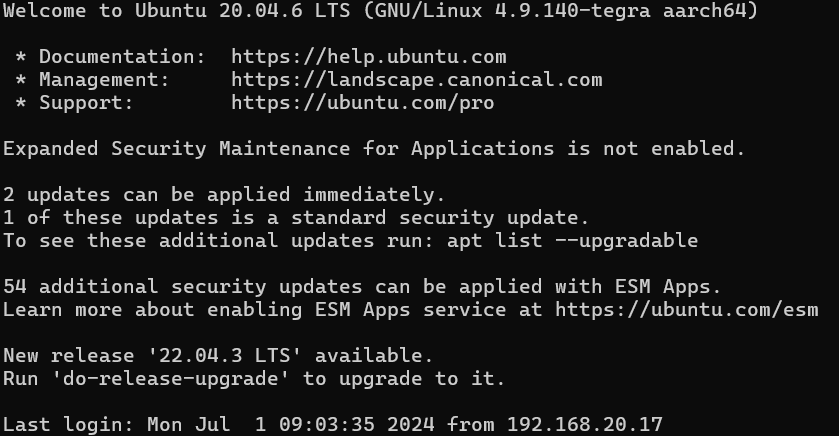

# Black Mamba


This repository contains the code and resources for designing and developing a mobile robotic platform using 
NVIDIA Jetson Nano and iRobot Create 2. The plataform utilizes the iRobot Create 2, the Nvidia Jetson Nano board, and the Intel RealSense D435 depth camera. The ROS packages in this repository include components for h andling the Create, descriptions and drivers, as  well as integrating the Jetson and ROS. Additionally, it inclued connections to Gazebo, descriptions, worlds, and controllers, and solutions for teleoperated robot control using PS4 controllers. 


<hr>

## Contents

- [Requirements](#requirements)
- [Installation](#Instalation)
    - [Custom Xubuntu Image](#custom-xubuntu-image)
    - [ROS Package](#ros-package)
- [Usage](#usage)
- [Components](#usage)
    - [Create](#create-robot)
    - [Description](#description)
<hr>

## Requirements

- Hardware: 
    - Nvidia Jetson Nano
    - Intel RealSense D435
    - PS4 Controller

- Software:
    - ROS 2 ([Foxy](https://docs.ros.org/en/foxy/Installation.html)), Gazebo, Rviz, etc...
    - [create_robot packages](https://github.com/AutonomyLab/create_robot.git)*
    - [ROS Wrapper and SDK for D435](https://github.com/IntelRealSense/realsense-ros.git)

* While building the Create package, there were issues with non-existent files needed as libraries. These files were modified to fit the current ROS version. 

Before building the Create package, you need to modify the *create_driver.cpp* file located at the following path:

```
cd /home/bm/bm_ws/src/create_robot/create_driver/src/
```

The line that needs to be modified is *#include "tf2_geometry_msgs/tf2_geometry_msgs.cpp". In ROS Foxy version, this file does not have .cpp extension but rather .h (this can be verified at the following path: */opt/ros/foxy/include/tf2_geometry_msgs/). Therefore, the line should be changed to:

```
#include "tf2_geometry_msgs/tf2_geometry_msgs.h"
```

After making this change, there should be no problem building the package with *colcon build*.

It is recommended to use the following line to allow future changes without the need for rebuilding:

```
colcon build --symlink-install
```

<hr>

## Instalation

### Custom Xubuntu Image

1. Download image from [this Nvidia Forum](https://forums.developer.nvidia.com/t/xubuntu-20-04-focal-fossa-l4t-r32-3-1-custom-image-for-the-jetson-nano/121768) and burn it in an SD card.

2. Regular install the operating system in the Jetson.

I tried to use the latest Nano Jetpack and docker containers (recommended by Nvidia), but I found it impossible to run.


### ROS Package
1. Clone this repository
```
git clone https://github.com/EdoCuadros/black_mamba.git
cd black_mamba
```
2. Install dependencies
```
rosdep install --from-paths src --ignore-src -r -y
```
3. Build the workspace
```
colcon build    # Go to your workspace 
source install/setup.bash   
```

## Usage

### Simulation

To configure, modify or try simulations; it is recommended to use an Ubuntu laptop instead of the Jetson itself for performance porpuses. 

Look for [.launch](launch/README.md) files.

### Robot

It is also strongly recommended to use Barrel Jack connector for additional power. Micro USB port does not provide sufficient power for the Jetson.

To control the robot, connect via ssh to the Jetson from an Ubuntu pc (maybe check if there's a change in the Jetson ip address).

- User: bm
- Password: 1.
- Ip address: 192.168.20.30
```
ssh bm@192.168.20.30
```

Once the connection is created, you should see a message like this:



The .bashrc file should include commands to source both the ROS packages and the Create packages. However, in the case of a clean install, you should source them first.

```
source /opt/ros/foxy/setup.bash
source /home/bm/bm_ws/install/setup.bash
```

Then you can launch the create bringup.

```
ros2 launch create_bringup create_2.launch
```

In another terminal, launch the joystick file. (Don't launch in Jetson, but in the pc instead)

```
ros2 launch black_mamba joystick.launch.py
```

Now you can start controlling the roomba with the PS4 controller.

## Components 


-  [Description files](description/README.md)
-  [Configuration files](config/README.md)


